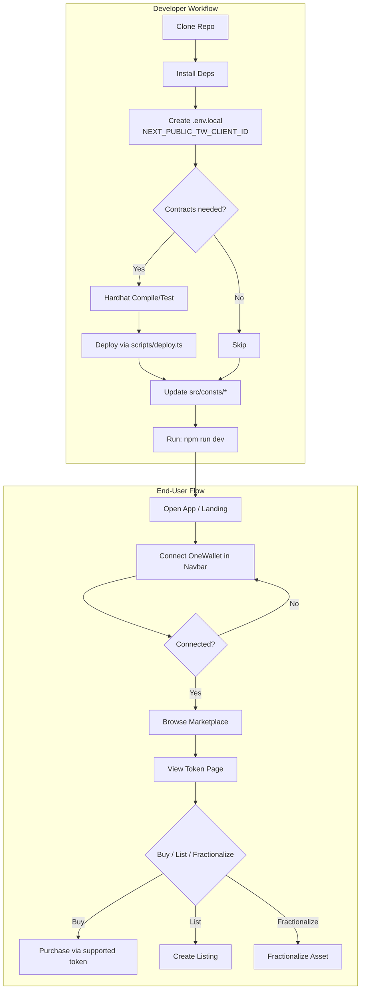

<div align="center">

  <h1>OneRWA Marketplace</h1>
  
  <p><strong>A decentralized marketplace for tokenized Real-World Assets (RWA) with NFT fractionalization capabilities.</strong></p>
  
  <p>
    <a href="https://nextjs.org/" target="_blank"></a>
    <a href="https://www.typescriptlang.org/" target="_blank"></a>
    <a href="https://hardhat.org/" target="_blank"></a>
    <a href="https://chakra-ui.com/" target="_blank"></a>
    <a href="https://thirdweb.com/" target="_blank"></a>
  </p>
</div>

---

## Table of Contents

- [Features](#features)
- [Tech Stack](#tech-stack)
- [Requirements](#requirements)
- [Getting Started](#getting-started)
- [Project Structure](#project-structure)
- [Scripts](#scripts)
- [Environment](#environment)
- [Workflow](#workflow)
- [Mermaid Flowchart (Dev + User Flow)](#mermaid-flowchart-dev--user-flow)
- [Demo](#demo)
- [Troubleshooting](#troubleshooting)
- [Contributing](#contributing)
- [License](#license)

## ✨ Enhanced Features

### 🎨 **Professional UI/UX**
- **Custom Typography**: Outfit for headings, Inter for body text, Space Grotesk for code
- **Smooth Animations**: Framer Motion powered transitions and micro-interactions
- **Modern Design**: Gradient backgrounds, glass morphism effects, and professional layouts
- **Responsive Design**: Optimized for desktop, tablet, and mobile devices

### 🛒 **Complete Trading System**
- **Advanced Buy Interface**: Modal-based purchase system with quantity selection
- **Real-time Pricing**: Dynamic price calculations and total cost display
- **Transaction Management**: Comprehensive error handling and success notifications
- **Multi-token Support**: Native tokens and ERC20 token payments

### 💳 **Enhanced Wallet Integration**
- **Universal Wallet Support**: MetaMask, WalletConnect, Coinbase Wallet, and more
- **Seamless Connection**: One-click wallet connection with automatic chain switching
- **Mobile Optimized**: Perfect wallet integration for mobile devices
- **Security First**: Secure transaction handling with user confirmations

### 🔍 **Advanced Marketplace**
- **Smart Search**: Real-time search with filtering by asset type and category
- **Professional Cards**: Enhanced asset cards with pricing, APY, and investment details
- **Category Filtering**: Filter by Real Estate, Carbon Credits, and more
- **Investment Analytics**: Expected returns and investment minimums displayed

### 📊 **Comprehensive Dashboard**
- **Portfolio Analytics**: Track your investments with visual charts and statistics
- **Asset Categorization**: Organized view of your holdings by asset type
- **Performance Metrics**: ROI tracking and investment history
- **Multi-chain Portfolio**: Unified view across all supported networks

## 🏗️ Smart Contracts

This project includes three core smart contracts for RWA tokenization and fractionalization:

### **PropertyNFT.sol**
- ERC721 contract for minting property-backed NFTs
- Owner-controlled minting with metadata URI support
- Represents unique real-world assets as non-fungible tokens

### **Fractionalizer.sol**
- Core contract for fractionalizing PropertyNFTs into ERC20 tokens
- Allows NFT owners to split ownership into tradeable fractions
- Enables redemption when all fractions are collected by one owner

### **Fraction.sol**
- ERC20 token representing fractional ownership of an NFT
- Minted by the Fractionalizer contract
- Burnable tokens for NFT redemption process

## Tech Stack

- **Frontend**: Next.js 14, React 18, TypeScript, Chakra UI
- **Web3 SDK**: thirdweb v5
- **Smart Contracts**: Solidity 0.8.24, OpenZeppelin v5.4.0, Hardhat v3
- **State Management**: @tanstack/react-query
- **Styling**: Framer Motion, Chakra UI with custom themes


## Dev + User Flow



## Getting Started

### 1. Install Dependencies
```bash
npm install
```

### 2. Set Up Environment Variables
Copy the example environment file and configure your thirdweb client ID:
```bash
cp .env.example .env.local
```

Edit `.env.local` and add your thirdweb client ID:
```
NEXT_PUBLIC_THIRDWEB_CLIENT_ID="your_thirdweb_client_id_here"
```

You can get a client ID from the [thirdweb dashboard](https://thirdweb.com/dashboard/settings/api-keys).

### 3. Run the Development Server
```bash
npm run dev
```

Open [http://localhost:3000](http://localhost:3000) in your browser to see the result.

### 4. Connect Your Wallet
- The application supports multiple wallet types through Thirdweb
- Click "Connect Wallet" in the navigation bar
- Choose from MetaMask, WalletConnect, Coinbase Wallet, and more
- For mobile users, use the hamburger menu to access wallet connection

### 5. Explore Features
- **Homepage**: Overview of available assets and platform statistics
- **Landing Page**: Detailed information about OneRWA platform
- **Marketplace**: Browse and search all available tokenized assets
- **Dashboard**: View your portfolio, holdings, and investment analytics

### Quick Start (All-in-One)

```bash
# 1) Install
npm install

# 2) Configure env
cp .env.example .env.local  # then edit .env.local

# 3) Run
npm run dev
```

## Customize Your Marketplace

### 1. Supported Networks
Deploy a [MarketplaceV3 contract](https://thirdweb.com/thirdweb.eth/MarketplaceV3) on each network you want to support. Add the desired chains to [`./src/consts/chains.ts`](./src/consts/chains.ts).

[Learn more about thirdweb Chains](https://portal.thirdweb.com/typescript/v5/chain).

### 2. Marketplace Contracts
Add your deployed MarketplaceV3 contract addresses and their corresponding chains to [`/src/consts/marketplace_contracts.ts`](/src/consts/marketplace_contract.ts).

### 3. Supported Currencies
Configure the ERC20 tokens you want to support for payments in [`./src/consts/supported_tokens.ts`](./src/consts/supported_tokens.ts).

## Learn More

To learn more about thirdweb, take a look at the following resources:

- [thirdweb Documentation](https://portal.thirdweb.com/) - learn about thirdweb features and API.
- [thirdweb Discord](https://discord.gg/thirdweb) - join our community for support and questions.

## Security

If you discover a security vulnerability, please report it by emailing `security@thirdweb.com`.


## Project Structure

- `contracts/` — Solidity contracts (`Fraction.sol`, `Fractionalizer.sol`, `PropertyNFT.sol`).
- `scripts/deploy.ts` — Hardhat deployment script(s).
- `src/` — Next.js app and components.
  - `src/app/` — Next.js routes (e.g., `landing/page.tsx`).
  - `src/components/` — UI components (e.g., `token-page/*`, `shared/*`).
  - `src/consts/` — Chain, contract, and token configuration.

## Scripts

From `package.json`:

```bash
npm run dev      # start Next.js dev server
npm run build    # build production bundle
npm run start    # start production server
npm run lint     # run Next.js lint
```

Hardhat (typical usage):

```bash
npx hardhat compile
npx hardhat test
# Deploy (example):
npx hardhat run scripts/deploy.ts --network <network>
```

## Environment

Create `.env.local` at repo root:

```
NEXT_PUBLIC_TW_CLIENT_ID="<your-thirdweb-client-id>"
```

You can obtain a client ID from the [thirdweb dashboard](https://thirdweb.com/dashboard/settings/api-keys).

## Workflow

1) Install dependencies: `npm install`

2) Configure environment: create `.env.local` with your Thirdweb client ID.

3) (Optional) Develop/compile/deploy contracts with Hardhat.

4) Update frontend configs:
   - Chains: `src/consts/chains.ts`
   - Marketplace contracts: `src/consts/marketplace_contract.ts`
   - Supported tokens: `src/consts/supported_tokens.ts`

5) Run the app: `npm run dev` and open http://localhost:3000

6) Connect wallet (OneWallet via navbar) and interact with marketplace pages.


## Troubleshooting

### Common Issues

#### Wallet Connection Issues
- **Desktop**: Ensure you have MetaMask, Coinbase Wallet, or another supported wallet extension installed
- **Mobile**: Use WalletConnect or the built-in browser of your mobile wallet
- **Connection Fails**: Try refreshing the page and reconnecting
- **Wrong Network**: The app supports Avalanche Fuji, Polygon Amoy, and Sepolia testnets

#### Build/Runtime Errors
- **Module not found errors**: Run `npm install` to ensure all dependencies are installed
- **Environment variable errors**: Ensure `.env.local` exists with valid `NEXT_PUBLIC_THIRDWEB_CLIENT_ID`
- **Next.js fails to start**: Clear `.next/` folder and retry: `rm -rf .next && npm run dev` (Windows: delete `.next` folder manually)
- **Scrypt compilation errors**: The project includes webpack configuration to handle this automatically

#### Performance Issues
- **Slow loading**: The app fetches real NFT metadata which may take time
- **Network timeouts**: Switch to a different RPC endpoint if needed
- **High gas fees**: Use testnets for development (Fuji, Amoy, Sepolia)

### Getting Help
- Check the [thirdweb documentation](https://portal.thirdweb.com/)
- Join the [thirdweb Discord](https://discord.gg/thirdweb) for community support
- Review contract addresses in `src/consts/` if using custom deployments

## Demo

- Screenshots or GIFs
  - Landing Page: `src/app/landing/page.tsx`
  - Token Page and Listing Flow: `src/components/token-page/*`
  
Add your media under `public/` and embed here:

```md


```

## Contributing

Contributions are welcome! Please:

- Fork the repo and create a feature branch.
- Follow existing code style and run `npm run lint`.
- Open a PR with a clear description and screenshots if UI changes.

## License

MIT ©  Contributors

